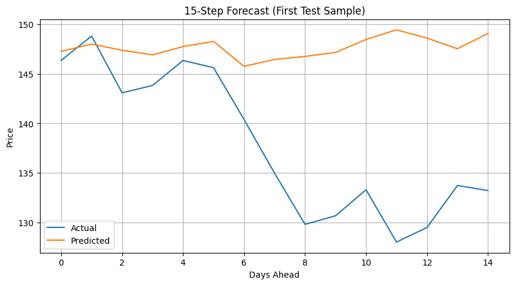

#  Stock Price Prediction using LSTM

##  Objective
To build an LSTM-based deep learning model that predicts the next 15 units of a stock’s adjusted closing price using historical data and technical indicators.

---

##  Features
- User input for stock symbol, date range, and timeframe
- Fetches historical data from Yahoo Finance via `yfinance`
- Visualizes:
  - Adjusted Close Price
  - MACD (Moving Average Convergence Divergence)
  - RSI (Relative Strength Index)
- Prepares sequences of past 60 days to predict next 15 days
- Trained LSTM model using Keras/TensorFlow
- Predicted future prices and compared with actual values
- Evaluated using **R² Score**: `0.8037`

---

##  Tech Stack
- Python
- yfinance
- pandas, numpy, matplotlib
- ta (technical analysis indicators)
- scikit-learn
- tensorflow (keras)

---

##  Visuals
### Actual vs Predicted:


---

##  Run the Project
1. Clone this repo
2. Install dependencies:
   ```bash
   pip install -r requirements.txt

